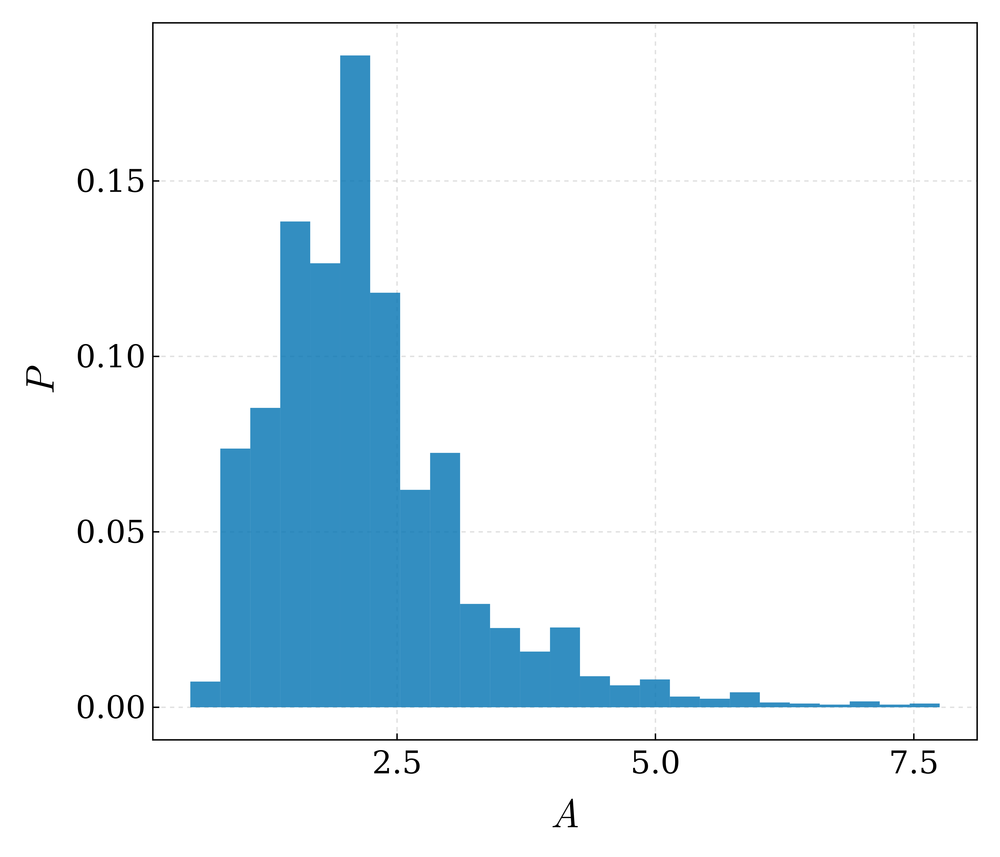
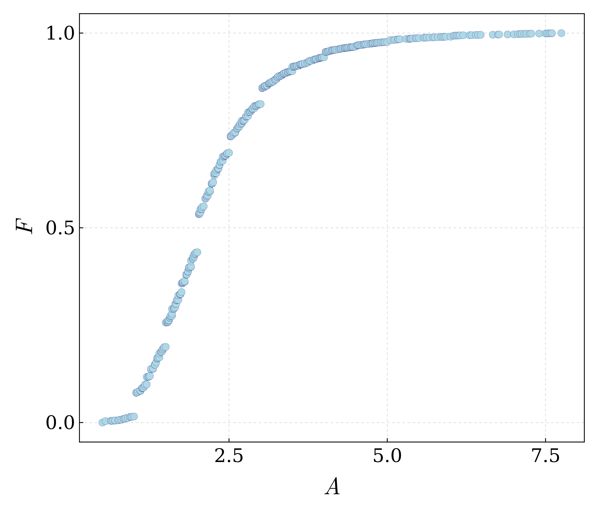
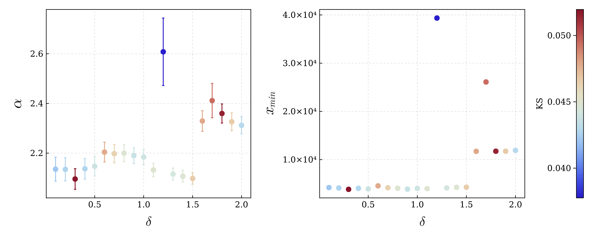
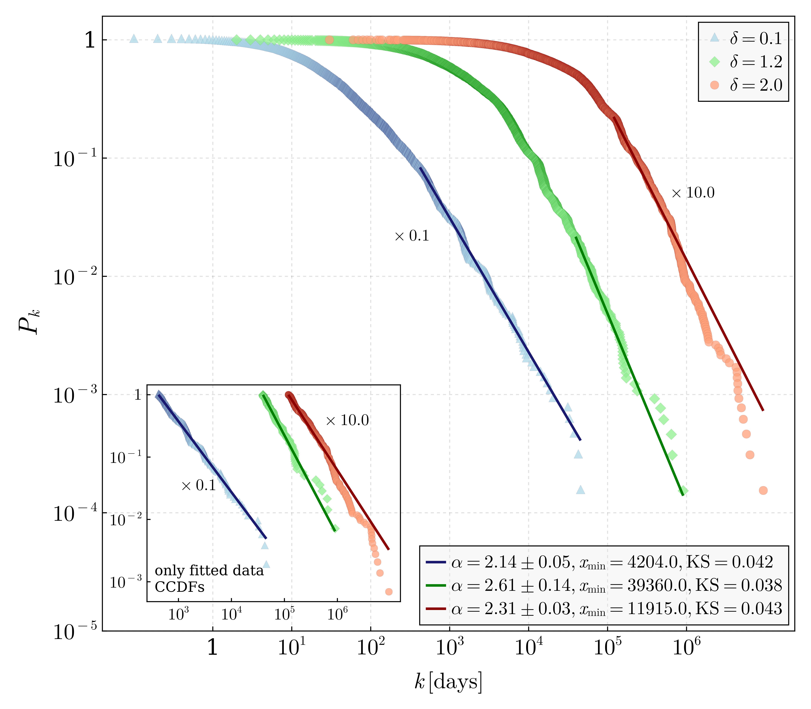
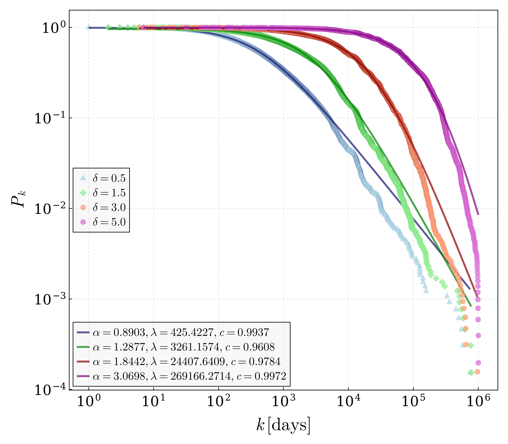
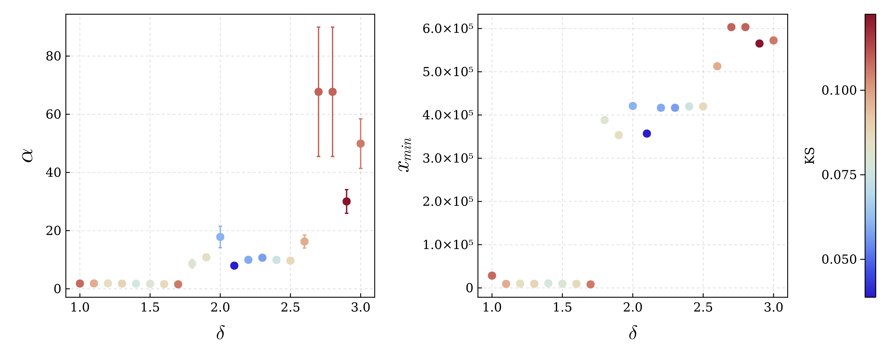
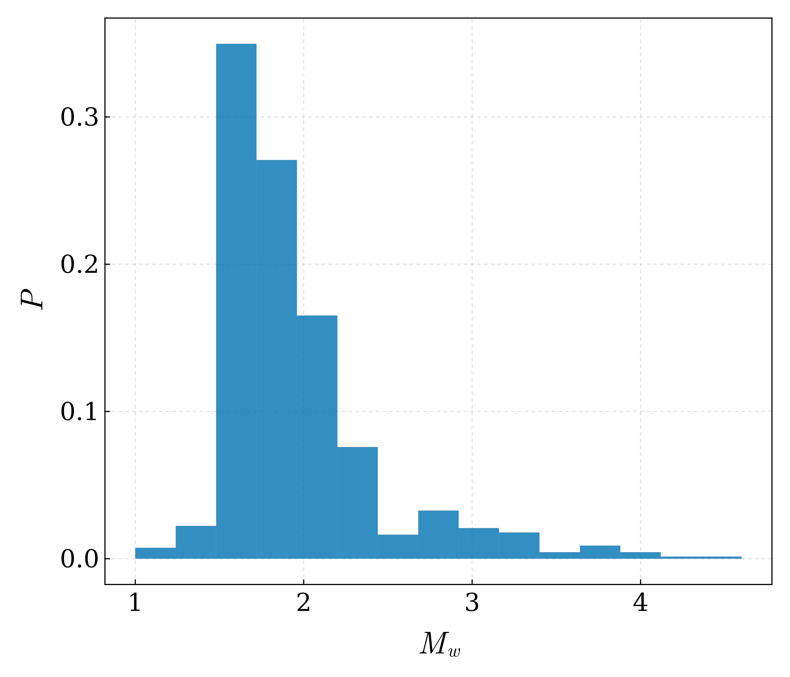
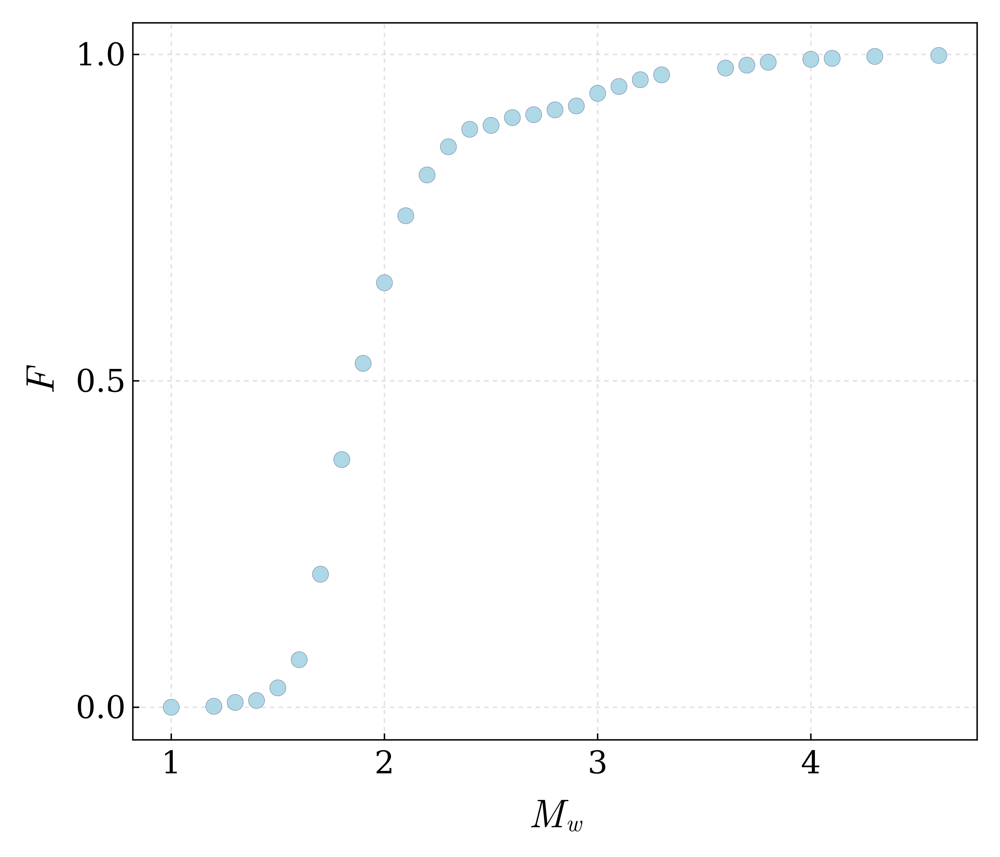
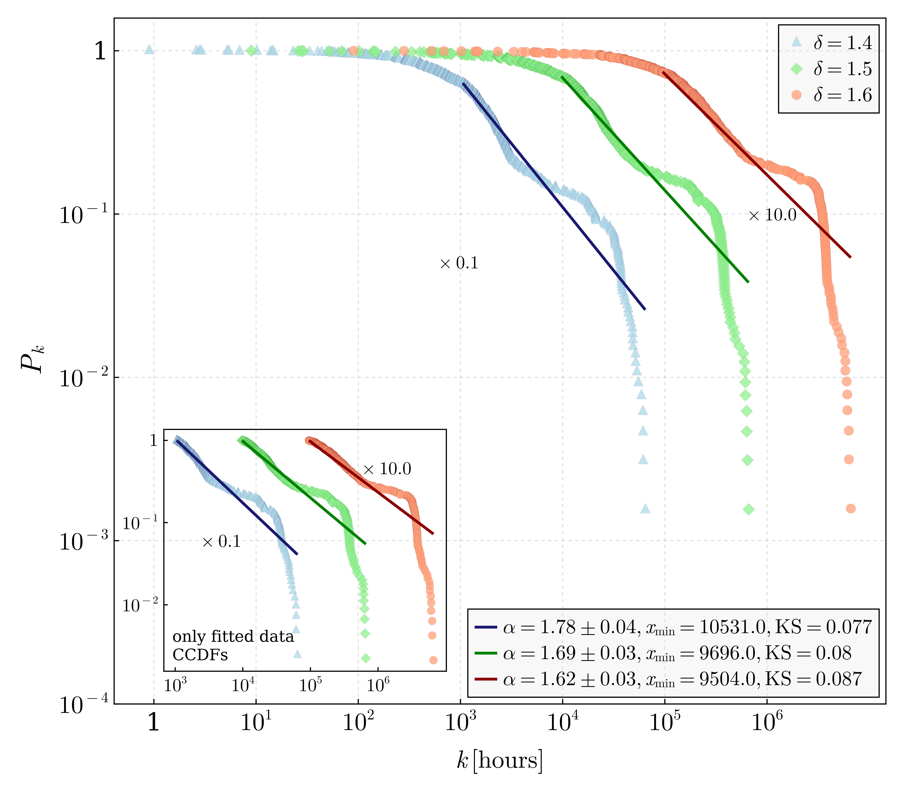
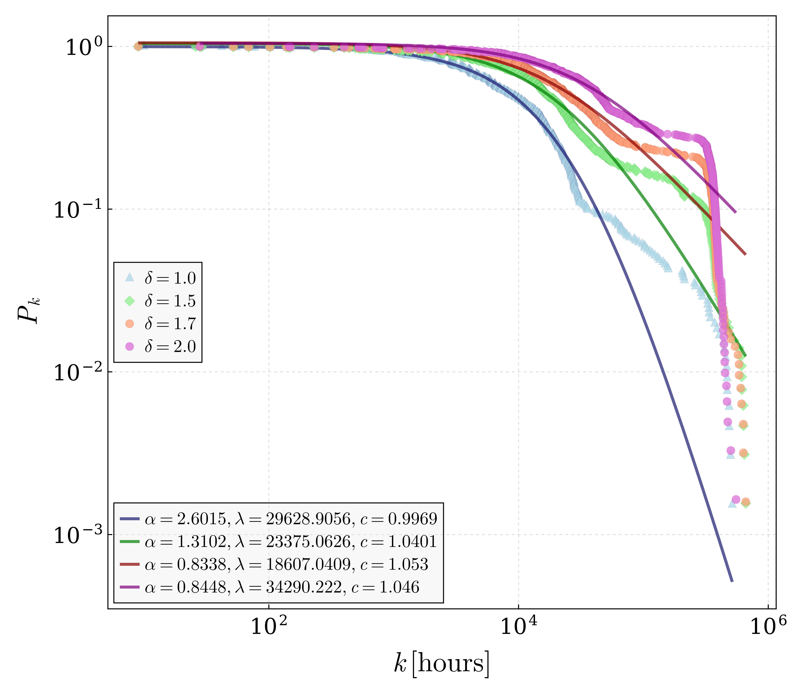

## Waiting times for moonquakes and marsquakes

This project represents an application of the waiting times analysis technique for quake data coming from extraplanetary sources.

The only available sources of reliable quake data other than earthquakes are:
- Moon: the Apollo missions
- Mars: the InSight mission
- Venus: the Venera 14 lander

In the case of Venus, the lander survived only for about an hour, transmiting seismic data that has been deemed unreliable.

The quake data analysed in this project are the moonquakes and marsquakes.

## Moonquakes

Exploratory data analysis

Power-law parameter dependence

Power-law fit for small waiting times

Pareto-Tsallis transition tested for high waiting times

## Marsquakes

Power-law parameter dependence

Exploratory data analysis

Power-law fit for small waiting times

Pareto-Tsallis transition tested for high waiting times

---

- This toolbox comes as support in part for the conference proceeding: [Waiting times distributions for moonquakes and marsquakes](https://doi.org/10.1063/5.0150572)
- Cite the proceeding as: G. T. Pana, S. Zgura, V. Baran and A. Nicolin, Waiting times distributions for moonquakes and marsquakes, AIP Conf. Proc. 2843, 020004 (2023), https://doi.org/10.1063/5.0150572.

Note: the results presented here are more advanced than those in the proceeding. The technique has been improved, and data re-analyzed. The basic waiting times principle remains.